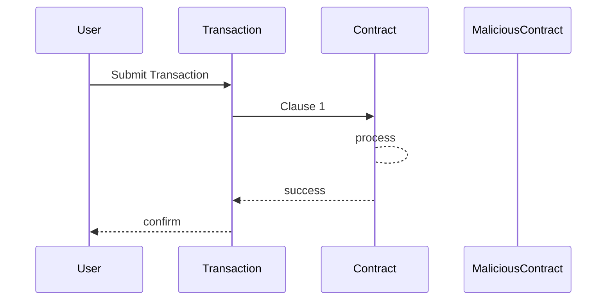
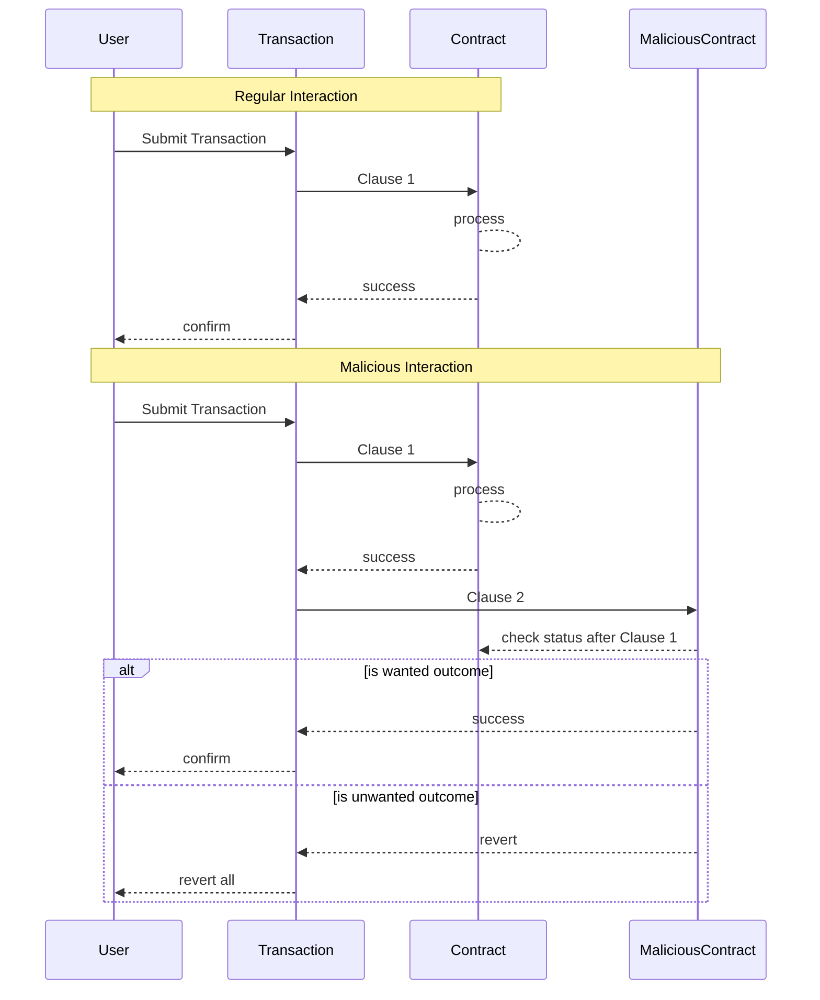
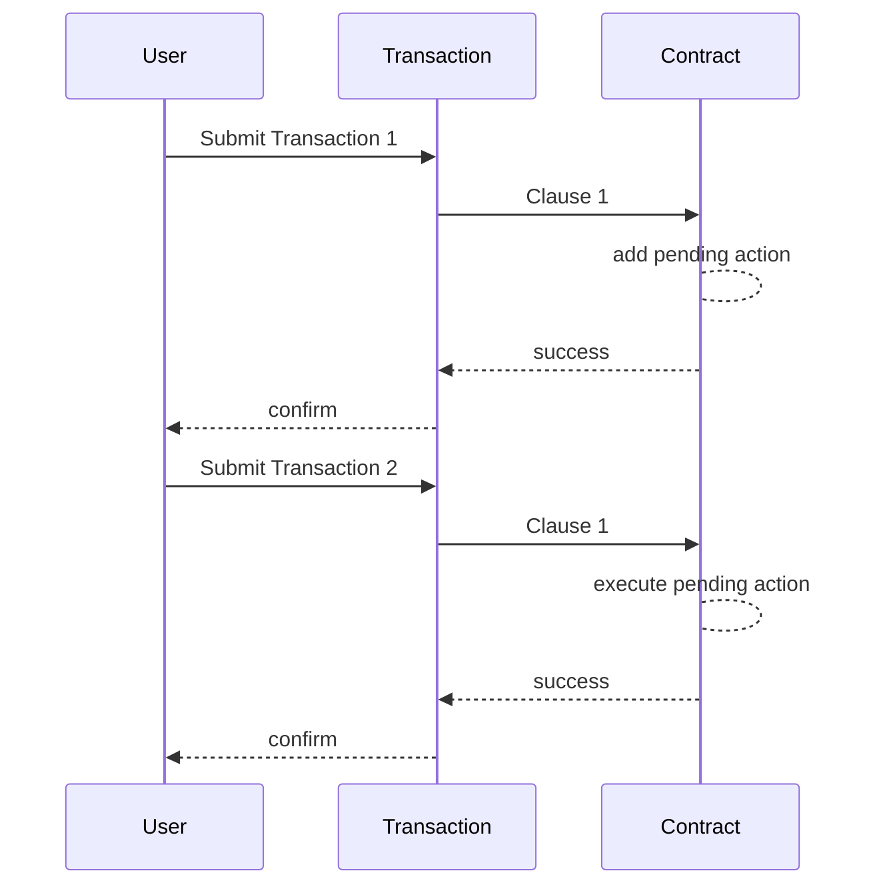

# Multi-Task atomic Transactions

Multi-Task atomic transactions allow developers to batch payments, add multiple calls to different contract functions into one transaction and determine their sequence.

## Remote Dependency control due Multi-Clause-Transactions

Multi-Clause-Transactions are an atomic compilation of multiple transactions into one. Every transaction on VeChain has at least one clause. If one clause fails, the whole transaction will revert.

Because of this dependency a bad actor can manually call contracts and add a custom clause that reverts if the outcome is not as expected.

#### A regular transaction containing one clause looks like this:



If someone wants to ensure the process meets expectations another clause can be added. The additional clause involves a check that reverts if the result is different. The revert will revert the whole transaction which includes potential changes from the first clause too:



## Vulnerability Scenario

Given there is a contract that accepts payments to roll a dice. The result is a random calculation within the contract. If the user guesses the correct side in advance the pool of money is sent as prize. If failed, the prize pool grows.

Given a bad actor creates a custom contract that checks if the prize pool is empty. If not, it reverts. Then the following scenario can happen:

<pre class="language-gherkin"><code class="lang-gherkin">Given a bad actor sends a transaction with two clauses
<strong>When the first clause (play) rolls the dice and loses
</strong>Then the second clause (check) reverts the whole transaction
</code></pre>

This can be repeated until it results in a win.

**Example vulnerable pseudo-contract:**



```solidity
// SPDX-License-Identifier: MIT
pragma solidity ^0.8.4;

contract Dice {
    uint256 public lastRoll;

    function roll(uint256 guess) public payable returns (uint256) {
        uint256 rolled = randomNumber(2);
        if (rolled == guess) {
            payable(msg.sender).transfer(address(this).balance);
        }
        lastRoll = rolled;
        return lastRoll;
    }

    function randomNumber(uint256 number) internal view returns (uint256) {
        return (uint256(blockhash(block.number - 1)) % number) + 1;
    }
}
```



## Potential Solution

#### Mitigating Dependency Risks with Multi-Block Processing

The input and the result can be split into different blocks. When an input is stored as pending, another actor is unable ensure a wanted outcome. The input is immutable.



The disadvantage of this are that two transactions will require:

1. Twice the VTHO costs
2. Double the processing time
3. Increased complexity to a contract due implementing a pending & processing status

### Links


Multi-Task Transactions


