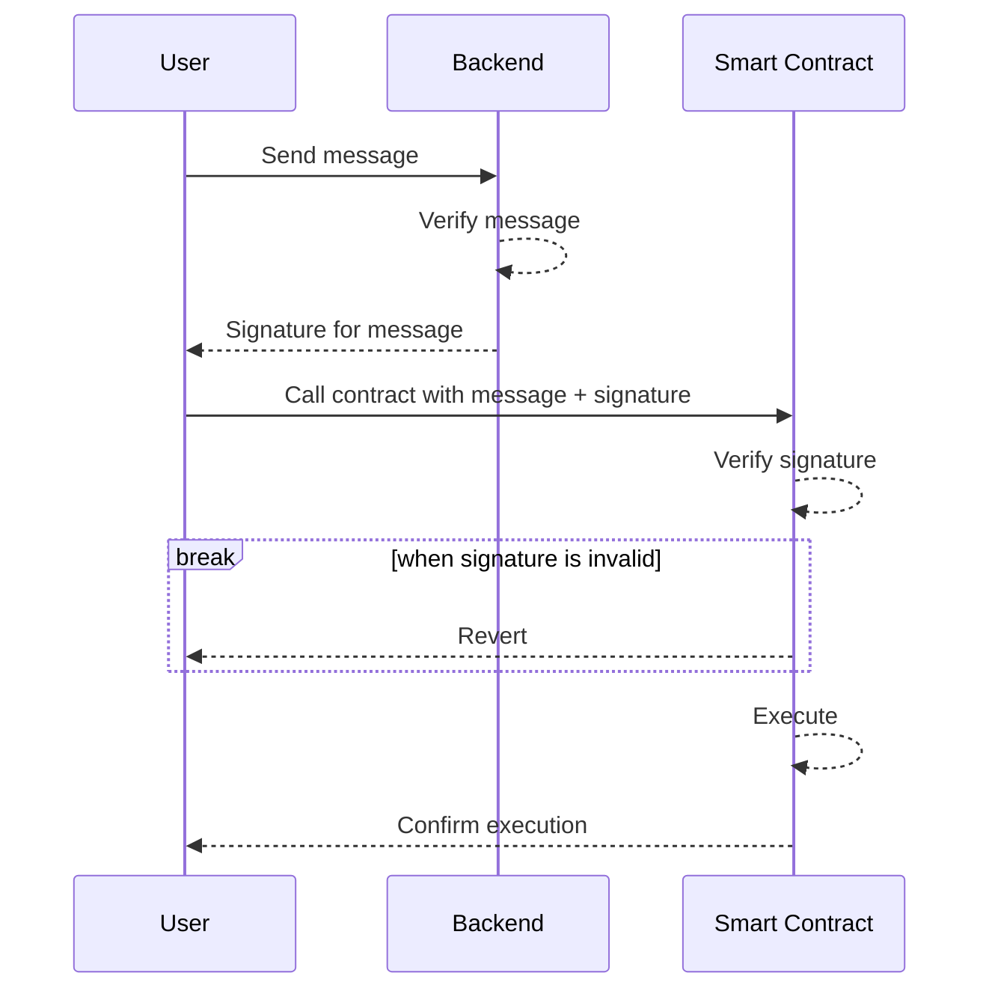

# How to verify a data source?

Smart contract functions can be called from various sources, including users, user scripts, or other contracts. In certain situations, it may be necessary to implement off-chain verification for input information. This article provides an example of how to enforce user verification of input data from a custom backend. It presents a concept for implementing an off-chain verification layer that can be verified on-chain.

The sequence of steps is as follows:



The contract will perform the following steps:

1. Verify the information using the signature.
2. If the signature is invalid, reject the action.
3. If the signature is valid, continue with the action.


# Preparation

Generate a new set of private/public keys that will be used to sign the message on the backend. Messages will be signed with the private key, and by sharing the public key, the contract will be able to verify that a message was signed by the backend.

```shell
PRIVATE_KEY=$(openssl rand -hex 32)
PUBLIC_ADDRESS=$(echo $PRIVATE_KEY | npx ethereum-private-key-to-address)
echo "Private Key: 0x$PRIVATE_KEY"
echo "Public Address: $PUBLIC_ADDRESS"
```

Output:
```shell
Private Key: 0x39b5e356c1bf588ac21bf616ee571ecbeb99561d92e0ae02c5113309a366446e
Public Address: 0x9653fCC59c221863FAD440163dE3DA17cC399C0e
```


# Backend

A CloudFlare Worker provides an online signing service. The backend can implement future logic, such as content or captcha validation.

It will:

1. Receive a GET request
2. Respond with a signature
3. The signature is used to call the contract

## Setup

Set up the project with `wrangler` and add `ethers` as a dependency:

```shell
wrangler init -y poc-verify-source-backend
yarn add ethers
```

Store the private key in the worker's secret environment:
```shell
$ wrangler secret put PRIVATE_KEY           
 ⛅️ wrangler 2.19.0 (update available 3.0.0)
------------------------------------------------------
✔ Enter a secret value: … ******************************************************************
🌀 Creating the secret for the Worker "proc-verify-source-backend" 
✨ Success! Uploaded secret PRIVATE_KEY
```

For local development, a different key can be stored in `.dev.vars`.

## Signing a message

The signing process is done using ethers' `signMessage()`:

```typescript
// Extract the message to sign from the url
const url = new URL(request.url)
const message = url.pathname.slice(1)

// Initialize a wallet with the secret private key
const ethers = await import('ethers');
const wallet = new ethers.Wallet(env.PRIVATE_KEY);

// Sign the message
const signedMessage = await wallet.signMessage(String(message));

// Return the signature
return new Response(signedMessage);
```

Any text sent in the URL is automatically signed by the backend.

The complete worker with CORS is available in the repository:
https://github.com/vechain-energy/poc-verify-source/blob/main/cloudflare-worker/src/index.ts

## Deployment

Deploy the worker using `wrangler deploy`:

```shell
$ wrangler deploy
 ⛅️ wrangler 3.0.1
------------------
Total Upload: 666.58 KiB / gzip: 165.00 KiB
Uploaded poc-verify-source-backend (3.61 sec)
Published poc-verify-source-backend (7.01 sec)
  verify-signature.example.vechain.energy (custom domain)
Current Deployment ID: …
```

## Test

Calling the URL with a test message will return a hex string, which is the signature of the message using the configured private key:

```shell
$ curl https://verify-signature.example.vechain.energy/test
0x11a91952fb6afaa68ca64768a26c2d70f3a88e852614e29c5a12bd95c34e49df1ff01b3a808d0962d95531f2e5a8fbcd732f4c12f96e789136dbc9fa6c23a0131b
```

This completes the backend part. Messages can now be sent to the service, analyzed, and signed off.

# Contract

## Setup

Initialize a new Hardhat project with the following commands:

```shell
mkdir contract-verification
cd contract-verification
yarn init -y
yarn add --dev hardhat @vechain.energy/hardhat-thor @nomiclabs/hardhat-waffle
yarn add --dev "@nomiclabs/hardhat-ethers@^2.0.0" "@types/sinon-chai@^3.2.3" "ethereum-waffle@*"
```

The Hardhat configuration for this project will be:

```js
require("@nomiclabs/hardhat-waffle");
require('@vechain.energy/hardhat-thor')

module.exports = {
  solidity: "0.8.18",
  networks: {
    vechain: {
      url: 'https://testnet.veblocks.net',
      privateKey: "0xada079fb56fd98a01b115c5905e1850da4a47309c4aa03cea794cfa504e6afb8",
      delegateUrl: 'https://sponsor-testnet.vechain.energy/by/90'
    }
  }
};
```

## Echo Contract

An example contract called Echo is used to store a message that can be set by anyone. The contract is defined in `contracts/Echo.sol`:

```sol
// SPDX-License-Identifier: UNLICENSED
pragma solidity ^0.8.9;

contract Echo {
    string message;

    function setMessage(string memory _message) public {
        message = _message;
    }
}
```

## Echo Deployment
The deployment script is simple and can be found in `scripts/deploy.js`:

```js
const hre = require("hardhat");

async function main() {
  console.log("Deploying Echo...");
  await hre.run('compile');

  const Echo = await hre.thor.getContractFactory("Echo");
  const echo = await Echo.deploy();

  await echo.deployed();
  console.log("Echo deployed to:", echo.address);
}

main()
  .then(() => process.exit(0))
  .catch((error) => {
    console.error(error);
    process.exit(1);
  });
```

Running `node scripts/deploy.js` will deploy the example contract for testing purposes:

```shell
$ node scripts/deploy.js                                                                          
Deploying Echo...
Compiled 1 Solidity file successfully
Echo deployed to: 0x164ad9d4291e4E0FDA6fB3d36f46c99F73d1df05
```

## Test Interaction

Using the contract inspector, a generic interaction can be tested. Visit the following URL and select the `message` function to retrieve the last message set in the contract. Use the `setMessage` function to update the message with any desired text.

Contract Inspector URL: 

https://testnet.vechain.energy/inspect/test/0x164ad9d4291e4E0FDA6fB3d36f46c99F73d1df05/manage?abi=https://gist.githubusercontent.com/ifavo/834a2a72f00baaf172947310d9d5dea1/raw/73a78151b1717f9be7adcbcc0f58e89873d4b6d3/artifact-Echo.json

For a better user experience, an `index.html` file is available in the repository and can be accessed on GitHub Pages at the following URLs:

- Repository: https://github.com/vechain-energy/poc-verify-source/blob/main/index.html
- GitHub Pages: https://vechain-energy.github.io/poc-verify-source/


## Verify Signature

OpenZeppelin offers utilities that solve recurring problems. ECDSA is a library that allows the identification of the public address used to create a signature.

By using the backend-calculated signature and the original signed message, we can "recover" the public address used to create the signature:

```sol
 address signer = keccak256(
    abi.encodePacked(
        "\x19Ethereum Signed Message:\n",
        Strings.toString(bytes(_message).length),
        _message
    )
).recover(signature);
```

The code might seem complicated because it includes magic strings. `ethers` uses EIP-712 to create the signature. EIP-712 suggests using a prefix and length of the message. One good reason for this is to prevent accidentally signing a transaction that cannot start with the prefix of `Ethereum Signed Message:`.

More information about EIP-712 can be found on ethereum.org: https://eips.ethereum.org/EIPS/eip-712

We modify the `setMessage` function to only set the message if it is signed off by a specific private key. This way, we know the public key (address) of the signer and can match the signature address to it:

```sol
// SPDX-License-Identifier: UNLICENSED
pragma solidity ^0.8.9;

import "@openzeppelin/contracts/utils/cryptography/ECDSA.sol";
import "@openzeppelin/contracts/utils/Strings.sol";

contract Echo {
    string public message;
    address private allowedSigner = 0x9653fCC59c221863FAD440163dE3DA17cC399C0e;

    using ECDSA for bytes32;

    function setMessageVerified(
        string memory _message,
        bytes memory signature
    ) public {
        require(verifySignature(_message, signature), "Invalid signature");
        message = _message;
    }

    function verifySignature(
        string memory _message,
        bytes memory signature
    ) private view returns (bool) {
        address signer = keccak256(
            abi.encodePacked(
                "\x19Ethereum Signed Message:\n",
                Strings.toString(bytes(_message).length),
                _message
            )
        ).recover(signature);
        console.log("detected signer: %s", signer);

        return (signer == allowedSigner);
    }
}
```

If the message and signature do not match or the signature is from a different source, the `signer` calculation will result in a different address, and the transaction will be reverted.

Running `node scripts/deploy.js` will deploy the updated example contract for testing purposes.

## Test

The `index.html` file in the repository showcases the full process:

- Repository: https://github.com/vechain-energy/poc-verify-source/blob/main/index.html
- GitHub Pages: https://vechain-energy.github.io/poc-verify-source/

To verify that this revert if signature or messages mismatch, use the contract inspector and the `setMessageVerified` function:

Using the contract inspector a generic interaction can be tested:

https://testnet.vechain.energy/inspect/test/0x164ad9d4291e4E0FDA6fB3d36f46c99F73d1df05/manage?abi=https://gist.githubusercontent.com/ifavo/834a2a72f00baaf172947310d9d5dea1/raw/73a78151b1717f9be7adcbcc0f58e89873d4b6d3/artifact-Echo.json

# Conclusion

This article presented a concept for verifying a data source using an off-chain backend and on-chain verification. By implementing a process to sign messages off-chain and verify the signatures on-chain, it is possible to ensure the authenticity of the data source.

Remember that this implementation is just an example and should be adapted to specific requirements and security considerations. 

Using this approach, it is possible to enforce off-chain verification for input data, enhancing the security and reliability of smart contract functions.

The project is available on GitHub at:  
https://github.com/vechain-energy/poc-verify-source