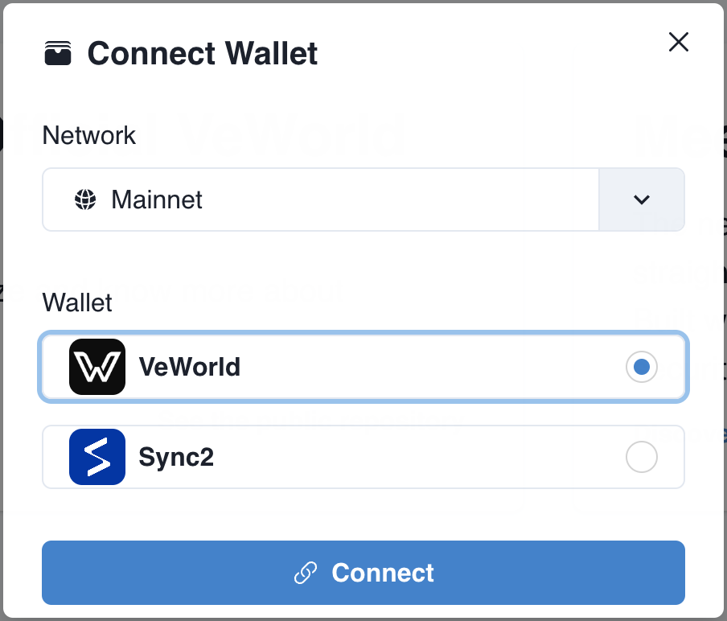

# How to add Support for VeWorld?

With VeWorld a new official Wallet was launched to strengthen the ecosystem.

The wallet is a browser extension, similar to MetaMask and is available at: [VeWorld.net](https://www.veworld.net/)

Previous VeChain dApps will continue to work and connect by default with Sync2.

# Migrate dApps to support VeWorld

Update [`@vechain/connex`](https://www.npmjs.com/package/@vechain/connex) to version >2.0.14.

Running `yarn install @vechain/connex` or `npm install @vechain/connex` will install the latest version.

# Detect if VeWorld is installed

VeWorld injects `window.vechain` which can serve as detection utility.

```js
const isInstalled = !!window.vechain
console.log('VeWorld is installed: ', isInstalled);
```

# Enforce Sync2, if VeWorld is installed

Connex has a new option `noExtension` which will force the use of Sync2. Pass it as option:

```js
const connex = new Connex({
  node: "https://mainnet.veblocks.net",
  network: "main",
  noExtension: true
})
```

# Suggestions for User Experience

Allow users to support selecting Sync2 and VeWorld until the end of year 2023.



Some users will try to install the new wallet instantly but are unable to migrate their previous accounts due the loss of seed phrases. Supporting both wallets will prevent accidental lock-outs.

There is an example dApp showing how to do it using a modal:  
https://vechainfoundation.github.io/veworld-dapp/

There is a public bug-report repository if problems arise:  
https://github.com/vechainfoundation/veworld-bug-report/issues