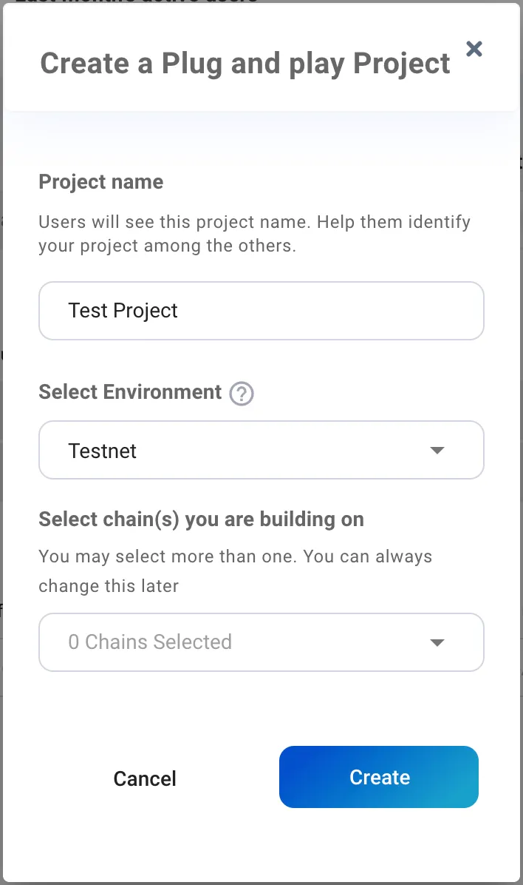
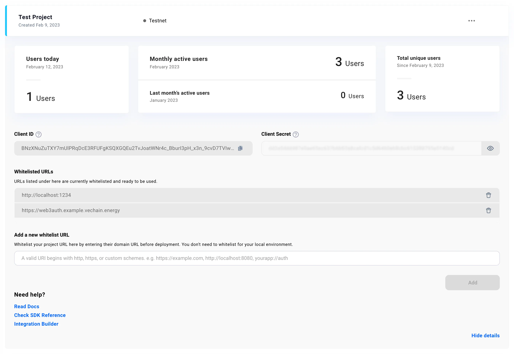

# Web2-Experience in Web3-Apps

Setting up a wallet with seed phrases and properly backing them up can be a significant challenge for regular users. Remembering a password is already difficult enough, many users end up losing their seed phrases or storing their backups in an insecure manner.

In this article, we'll show you how to set up an alternative authorization method using the services of Web3Auth.

This service provides a non-custodial way of storing private keys by splitting them so that access can be claimed using social credentials.

You can read more about key management on the Web3Auth website:  
https://web3auth.io/docs/overview/key-management/.

# Setup Web3Auth

To get started, sign up for an account at https://dashboard.web3auth.io.

Then, create a project in the "Plug and play" section. All you need is a project name and environment.




Next, copy the Client ID and add the URL to the whitelist you'll be using during development. For example, `http://localhost:3000 `is normally used for React, and `http://localhost:1234` is the default for Parcel.



# Sample Project

You can access a sample project using Parcel and React from the following GitHub repository:  
https://github.com/vechain-energy/openlogin-transaction

This project contains a fully working sample that you can use to test and explore the code snippets explained below.

The following libraries are used in this project:

- `@vechain/connex` to build the raw data for contract interaction and allow a logical fork at the latest step between Web3Auth and Connex-Signing-Service.
- `thor-devkit` to manually handle transaction signing.
- `@vechain/ethers` for custom wallet management with a private key.
- `@walletconnect/client` and `@web3auth/modal` for the Web3Auth implementation.

# Web3Auth

## Initialize Web3Auth

To initialize Web3Auth, you'll need the Client ID you copied earlier. In this example, the `chainNamespace` must be set to "other" since VeChain is not supported. The project was set up for TestNet, so `testnet` is used as the `web3AuthNetwork`.


```ts
import { Web3Auth } from "@web3auth/modal";
import { OpenloginAdapter } from "@web3auth/openlogin-adapter";
import { CHAIN_NAMESPACES, ADAPTER_EVENTS, CONNECTED_EVENT_DATA } from "@web3auth/base";

const web3auth = new Web3Auth({
  clientId: WEB3AUTH_CLIENT_ID,
  web3AuthNetwork: WEB3AUTH_NEWORK,
  chainConfig: {
    chainNamespace: CHAIN_NAMESPACES.OTHER,
    displayName: 'VeChain',
    ticker: 'VET',
    tickerName: 'VeChain'
  },
});
```

Next, create a provider that provides access to the user's private key using the OpenLogin Adapter:

```js
const openloginAdapter = new OpenloginAdapter({
  adapterSettings: {
    network: WEB3AUTH_NEWORK,
    uxMode: "redirect"
  },
});
web3auth.configureAdapter(openloginAdapter);
```

This setup is based on https://web3auth.io/docs/sdk/web/providers/other

To complete the initialization the Adapter needs to be initialized once when UI is ready for the user. An effect does that:


```js
  useEffect(() => {
    web3auth.initModal()
  }, [])
  ```
  

## Sign In and Sign Out

The web3auth instance offers a `connect()` and `logout()` functionality that initiate the corresponding processes:

```tsx
  const handleSignIn = async (): Promise<void> => { await web3auth.connect() }
  const handleSignOut = async (): Promise<void> => web3auth.logout()
```

These methods can be used in a React component to trigger the sign in and sign out processes, respectively. For example:

```tsx  
  return (
		<div>
	    <Button block size='large' type='primary' onClick={handleSignIn}>sign in</Button>
			<Button block size='large' danger onClick={handleSignOut}>sign out</Button>
		</div>
	)
```

## Wallet / Private Key Access

To get access to the wallet's private key, an event listener for the CONNECTED event of the web3auth adapter can be used. The example stores the private key in the component's state:


```ts
const subscribeAuthEvents = (web3auth: Web3Auth) => {
    web3auth.on(ADAPTER_EVENTS.CONNECTED, (data: CONNECTED_EVENT_DATA) => {
      console.log("connected to wallet", data);

			// Store Private Key in State
      if (web3auth.provider) {
        web3auth.provider.request({ method: "private_key" })
          .then(privateKey => setPrivateKey(String(privateKey)))
      }

    });
  };

  useEffect(() => {
    subscribeAuthEvents(web3auth)
  }, [])
```
  
This event listener listens for the `CONNECTED` event and retrieves the private key from the web3auth adapter. The private key can be used to sign transactions and interact with the blockchain.

# Transaction

With the help of `thor-devkit` transactions an be built and signed using a private key. The snippet will also use fee delegation to make the transactions gasless too.

## Create Transaction Instance

```ts
	import { Transaction, secp256k1 } from "thor-devkit";

  const transaction = new Transaction({
    chainTag: Number.parseInt(connex.thor.genesis.id.slice(-2), 16),
    blockRef: connex.thor.status.head.id.slice(0, 18),
    expiration: 32,
    clauses,
    gas: 30000,
    gasPriceCoef: 128,
    dependsOn: null,
    nonce: +new Date(),
    reserved: {
      features: 1 // this enables the fee delegation feature
    }
  });
```

## Get Fee Delegation Signature

With fee delegation the gas costs are removed and any new wallet can instantly interact with the network. This is a sample to get a signature from a delegation service:

```ts
  // build hex encoded version of the transaction for signing request
  const rawTransaction = `0x${transaction.encode().toString("hex")}`;

  // request to send for sponsorship/fee delegation
  const sponsorRequest = {
    origin: wallet.address,
    raw: rawTransaction
  };

  // request sponsorship
  const { signature, error } = await post(DELEGATE_URL, sponsorRequest);

  // sponsorship was rejected
  if (error) {
    throw new Error(error);
  }
```

## Signing the Transaction

The transaction is signed with the private key of the user using `secp256k1`:

```ts
  // sign transaction with the known private key
  const signingHash = transaction.signingHash();
  const originSignature = secp256k1.sign(
    signingHash,
    Buffer.from(privateKey.slice(2), "hex")
  );
```

For fee delegation the signature from the service is added to the transactions signature too:

```ts
  // build combined signature from both parties
  const sponsorSignature = Buffer.from(signature.substr(2), "hex");
  transaction.signature = Buffer.concat([originSignature, sponsorSignature]);
```

## Broadcast Transaction

Sending the transaction to the network is a single `POST` request to the network node:

```ts
  // post transaction to node
  const signedTransaction = `0x${transaction.encode().toString("hex")}`;
  const { id } = await post(`https://testnet.veblocks.net/transactions`, {
    raw: signedTransaction
  });
```

The transaction id is returned and can be used for further handling.

# Conclusion

This article has shown how to set up an alternative authorization method using the services of Web3Auth, a service that provides a non-custodial way that can be claimed using social credentials.

The sample project demonstrates how to initialize Web3Auth, sign in and sign out, retrieve the private key from the Web3Auth adapter, and create an example transaction on the blockchain.

Web3Auth can be used to on-board users with a well known social sign in. In combination with Fee Delegation it allows an instant-use-experience that removes all complexity of web3/crypto from the enduser. A website with a blockchain backend will just feel like a regular website.