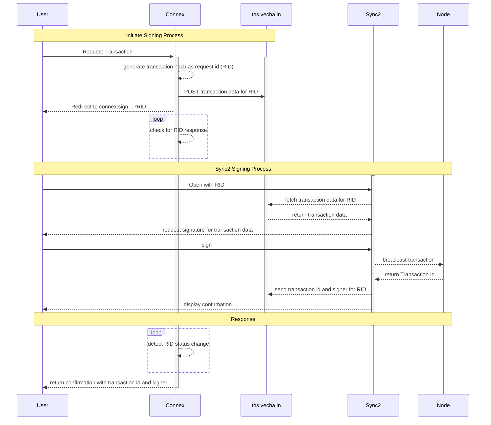

# Interaction with Sync2

## Certificate

```javascript
const { blake2b256 } = require('thor-devkit')
const bent = require('bent')
const sleep = (time) => new Promise(resolve => setTimeout(resolve, time))

async function main() {
  const json = {
    gid: "0x000000000b2bce3c70bc649a02749e8687721b09ed2e15997f466536b20bb127",
    nonce: +new Date(),
    type: 'cert',
    payload: {
      message: {
        payload: {
          content: 'hello from my custom submission',
          type: 'text'
        },
        purpose: 'identification'
      },
      options: {
        comment: 'Hello!'
      }
    }
  }
  const hash = blake2b256(JSON.stringify(json)).toString('hex')
  const tosUrl = `https://tos.vecha.in/${hash}`

  console.log('Calculated Hash:', hash)
  console.log('Posting Request to:', tosUrl)
  console.log('JSON Object:', JSON.stringify(json, null, 2))

  const post = bent('POST', 'https://tos.vecha.in/', 'string')
  const get = bent('GET', 'https://tos.vecha.in/', 'string', [200, 204])
  await post(hash, json)

  console.log('Send your user to:', `https://lite.sync.vecha.in/#/sign?src=${encodeURIComponent(tosUrl)}`)
  console.log('or to:', `connex:sign?src=${encodeURIComponent(tosUrl)}`)
  console.log('')
  console.log('You can check if Sync2 has opened the transaction on:', `${tosUrl}.accepted`)
  console.log('You can fetch the signing response at:', `${tosUrl}.resp`)

  do {
    const response = await get(`${hash}.accepted`)
    if (!response) {
      console.log('Waiting for acceptance…')
    }
    else {
      const jsonResponse = JSON.parse(response)
      console.log('User opened Sync2 with the transaction information')
      break
    }
    await sleep(6 * 1000)
  } while (true)

  do {
    const response = await get(`${hash}.resp`)
    if (!response) {
      console.log('Waiting for response…')
    }
    else {
      const jsonResponse = JSON.parse(response)
      console.log('Response received:', JSON.stringify(jsonResponse, null, 2))
      break
    }
    await sleep(6 * 1000)
  } while (true)
}


main()
  .then(() => process.exit(0))
```

## Transaction

```javascript
const { blake2b256 } = require('thor-devkit')
const bent = require('bent')
const sleep = (time) => new Promise(resolve => setTimeout(resolve, time))

async function main() {
  const json = {
    gid: "0x000000000b2bce3c70bc649a02749e8687721b09ed2e15997f466536b20bb127",
    nonce: +new Date(),
    type: 'tx',
    payload: {
      message: [{
        data: "0xd09de08a",
        to: "0x8384738c995d49c5b692560ae688fc8b51af1059",
        value: "0",
        comment: 'Clause Comment'
      }],
      options: {
        comment: 'Test Transaction',
        delegator: {
          url: 'https://sponsor-testnet.vechain.energy/by/90'
        }
      }
    }
  }
  const hash = blake2b256(JSON.stringify(json)).toString('hex')
  const tosUrl = `https://tos.vecha.in/${hash}`

  console.log('Calculated Hash:', hash)
  console.log('Posting Request to:', tosUrl)
  console.log('JSON Object:', JSON.stringify(json, null, 2))

  const post = bent('POST', 'https://tos.vecha.in/', 'string')
  const get = bent('GET', 'https://tos.vecha.in/', 'string', [200, 204])
  await post(hash, json)

  console.log('Send your user to:', `https://lite.sync.vecha.in/#/sign?src=${encodeURIComponent(tosUrl)}`)
  console.log('or to:', `connex:sign?src=${encodeURIComponent(tosUrl)}`)
  console.log('')
  console.log('You can check if Sync2 has opened the transaction on:', `${tosUrl}.accepted`)
  console.log('You can fetch the signing response at:', `${tosUrl}.resp`)

  do {
    const response = await get(`${hash}.accepted`)
    if (!response) {
      console.log('Waiting for acceptance…')
    }
    else {
      const jsonResponse = JSON.parse(response)
      console.log('User opened Sync2 with the transaction information')
      break
    }
    await sleep(6 * 1000)
  } while (true)

  do {
    const response = await get(`${hash}.resp`)
    if (!response) {
      console.log('Waiting for response…')
    }
    else {
      const jsonResponse = JSON.parse(response)
      console.log('Response received:', JSON.stringify(jsonResponse, null, 2))
      break
    }
    await sleep(6 * 1000)
  } while (true)
}


main()
  .then(() => process.exit(0))
```

## Process Overview

