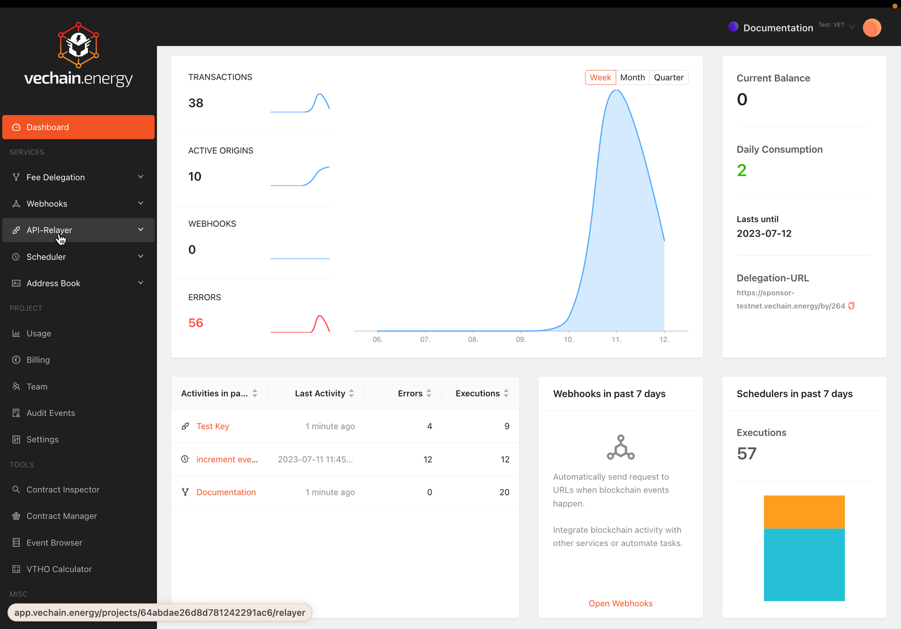

# Debugging

## Logs

In the dashboard, you can find combined information about the API-Key-Requests, Fee Delegation, and the Transaction, providing instant insight into each transaction.

The Execution Logs in the API-Relayer section provide details about each execution.




## Requests

The Request-Response will contain instant information about the quality of the data.

### Invalid Transaction-Data

Error messages are passed from the libraries used to encode the transaction data. An invalid ABI will return a generic message:

```json
{
	"code": "INTERNAL_SERVER_ERROR",
	"name": "TRPCError",
	"message": "TRPCError: Parameter decoding error: Returned values aren't valid, did it run Out of Gas? You might also see this error if you are not using the correct ABI for the contract you are retrieving data from, requesting data from a block number that does not exist, or querying a node which is not fully synced."}
}
```

While a specific error, such as an invalid parameter count, will be more specific:

```json
{
	"code": "INTERNAL_SERVER_ERROR",
	"name": "TRPCError",
	"message": "TRPCError: Parameter encoding error"
}
```

### Fee Delegation is Low on VTHO

```json
{
	"code": "INTERNAL_SERVER_ERROR",
	"name": "TRPCError",
	"message": "TRPCError: transaction not correctly created, response: tx rejected: insufficient energy\n"
}
```