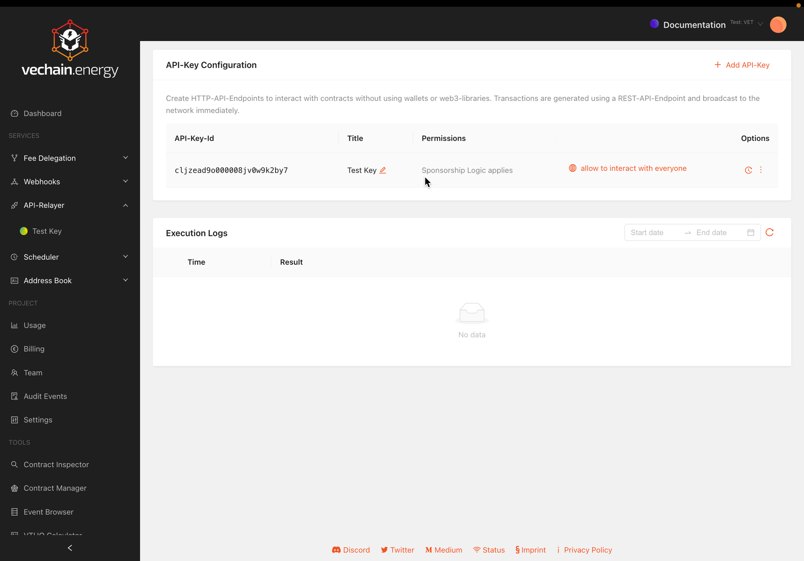

# Options

## Permission

By default, all transactions initiated by an API key are restricted to the Fee Delegation Configuration. Only sponsored transactions can be submitted to the blockchain.

The restriction can be lifted to allow the API key to interact with everyone.

## Test before Submission

By passing the query parameter `?test=true`, you can simulate the transaction before broadcasting it. If the simulation indicates that the transaction will revert, it will not be broadcast.

Simulations help to save gas fees for potentially failing transactions.

## Transaction Depencency

By posting `dependsOn` with a transaction id with a request, the transaction will be executed after the transaction with the given id has been executed (or fail after 32 blocks).

## Enable / Disable

Disabling an API-Key takes effect immediately. It can be re-enabled any time.
