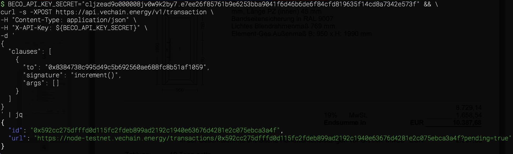

# Sending a Transaction

## Authentification

The API-Key-Secret is sent as header in `X-API-Key` and authorizes the request.

### Bring Your Own Private Key

Optionally, a private key can be passed in the headers using `X-Private-Key`. This private key is used to sign the transaction instead of the default identity assigned to the API key.

### Transaction Request

Transactions can be provided in different formats, with a focus on human-friendly interactions.

The OpenAPI Documentation for the Endpoint is available here:  
https://app.vechain.energy/docs/api/transact

A transaction can be tested in the API documentation, and with the help of the Contract Manager, code snippets can also be generated.





## Simplified String

```
<address>.<funcName>(...[type value])
```

For example:

```
0x8384738C995D49C5b692560ae688fc8b51af1059.increment()
```

Values with `,` can be escape with a `\`, for example: `.funcName(string 1\\,5)`.

## ABI

If an ABI definition is given, the function call is encoded using the ABI definition and the list of args.

```json
{
	"to": "0x8384738C995D49C5b692560ae688fc8b51af1059",
	"abi": {
		"inputs": [],
		"name": "increment",
		"outputs": [],
		"stateMutability": "nonpayable",
		"type": "function"
	},
	"args": []
}
```

## Signatures

Using a signature is simpler than an ABI, it is the function definition with data types and more human friendly:

```json
{
	"to": "0x8384738C995D49C5b692560ae688fc8b51af1059",
	"signature": "increment()",
	"args": []
}
```


## Raw Clause Data

Already encoded data can be sent as raw clause data:

```json
{
	"to": "0x8384738C995D49C5b692560ae688fc8b51af1059",
	"data": "0xd09de08a"
}
```

Contract-Deployments can be achieved sending `data` without `to`.
