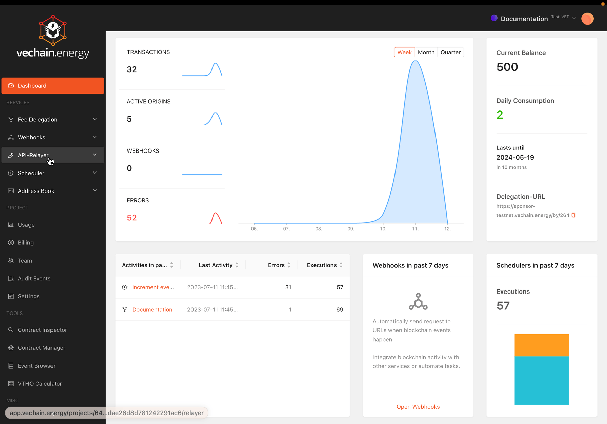

# Setup a Transaction-API-Relay

## Create API-Key

Creating an API key requires a title and locally storing the API key secret. The secret is not stored online and cannot be retrieved later.

API keys are activated instantly.

