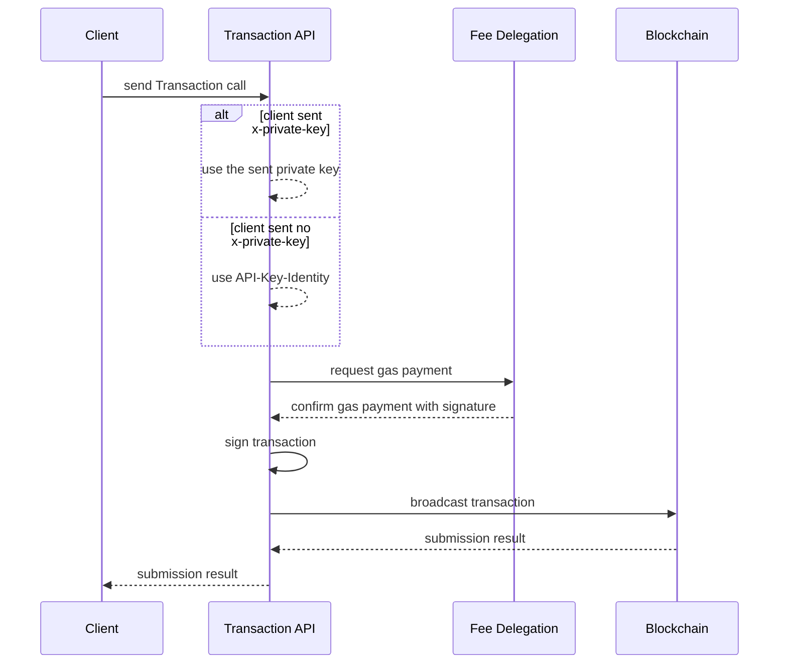

# What is a Transaction-API-Relay?

Transactions require a cryptographic signature using a private key. However, the libraries for creating signatures or building the correct transaction object are not universally available.

The Transaction API serves as an intermediary where the signing and transaction processes can be outsourced. It offers a REST API in a user-friendly format, allowing transactions to be initiated with a single HTTP POST request.

## Why is it important?

Implementing Blockchain technology into existing applications can be challenging or even impossible due to limitations in adding new libraries or introducing overhead for interaction.

By utilizing an HTTP REST API to interact with a Blockchain, seamless integration with all connected applications becomes possible.

## What does it allow?

Legacy applications that support HTTP can now send data to blockchain contracts, enabling functionalities such as integration with IFTTT (If This, Then That).

## What are the use-cases?

Blockchain can serve as a decentralized database, allowing for various applications. For example, it can facilitate the issuance of NFTs for sales from within a CRM and the ability to attach additional information later on.

## How does it work?

