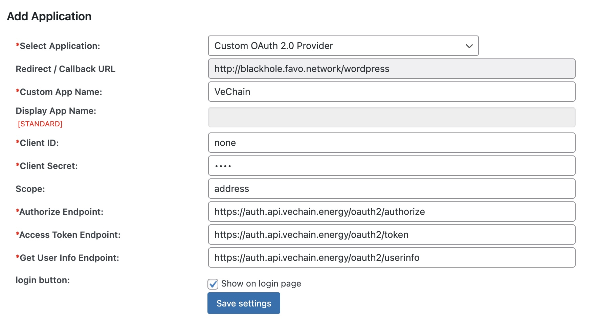
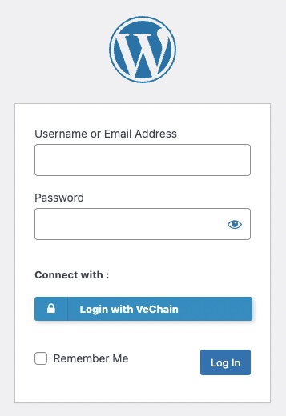

### WordPress

SSO using Plugin [https://wordpress.org/plugins/oauth-client/](https://wordpress.org/plugins/oauth-client/)

| Configuration          | Value                                            |
| ---------------------- | ------------------------------------------------ |
| Custom App Name        | VeChain                                          |
| Client ID              | none                                             |
| Client Secret          | none                                             |
| Scope                  | identity                                         |
| Authorize Endpoint     | https://auth.api.vechain.energy/oauth2/authorize |
| Access Token Endpoint  | https://auth.api.vechain.energy/oauth2/token     |
| Get User Info Endpoint | https://auth.api.vechain.energy/oauth2/userinfo  |
| Username attribute     | address                                          |

| | |
| :-: | :-: |
|  |  |
