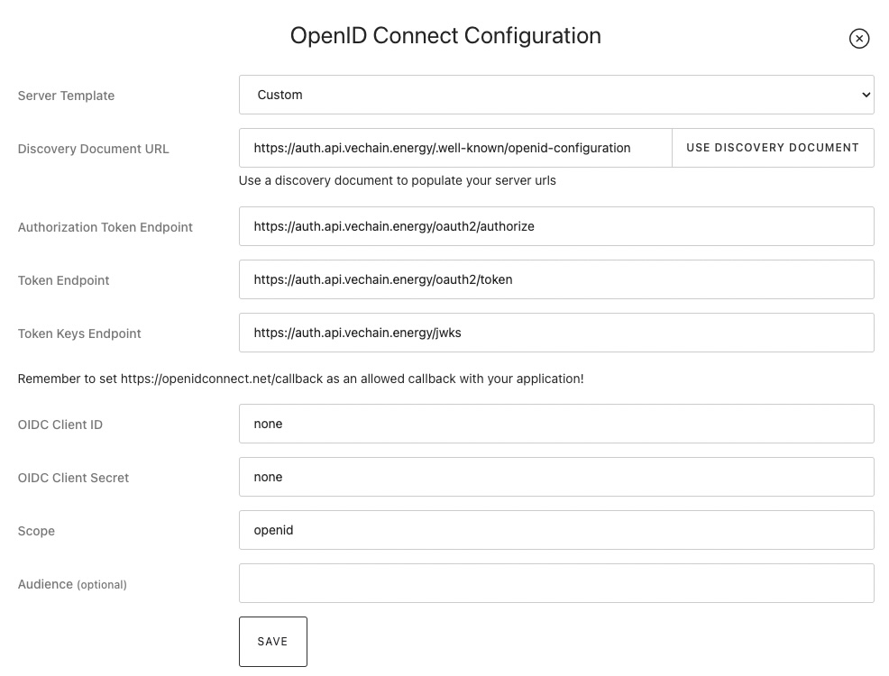

# OpenID Connect

## Configuration

| Configuration               | Value                                                            |
| --------------------------- | ---------------------------------------------------------------- |
| Discovery Document URL      | https://auth.api.vechain.energy/.well-known/openid-configuration |
| Authorization URL (MainNet) | https://auth.api.vechain.energy/oauth2/authorize                 |
| Authorization URL (TestNet) | https://auth.api.vechain.energy/oauth2/authorize?network=test    |
| Token URL                   | https://auth.api.vechain.energy/oauth2/token                     |
| Userinfo URL                | https://auth.api.vechain.energy/oauth2/userinfo                  |
| Token Keys URL              | https://auth.api.vechain.energy/jwks                             |
| Client ID                   | none                                                             |
| Client secret               | none                                                             |
| Available scopes            | <ul><li>identity</li><li>profile (provides a nickname)</li></ul> |

**The configuration can be tested using the OpenID Connect Playground from Auth0:**
https://openidconnect.net/

## Notes

1. Default expiration is 1 year
2. A refresh token is currently not supported, new authorization is suggested after the token expires
