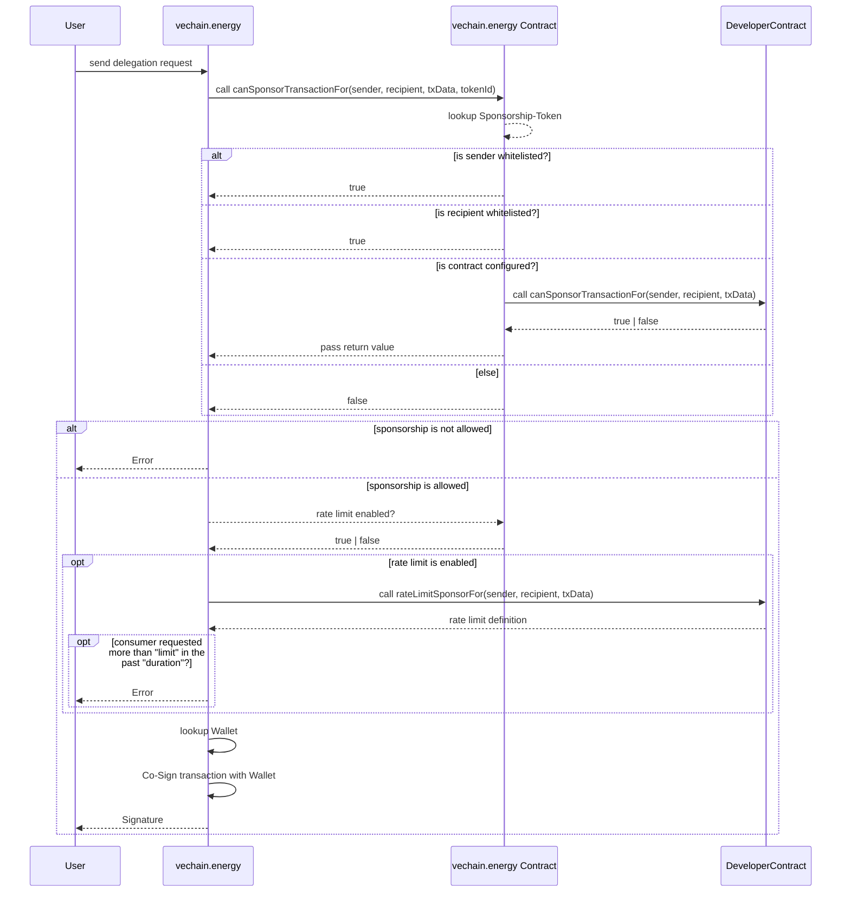

# Contract-Rate-Limits

Every rate limit is defined by the maximum number of requests for a given duration. For example a limit of 10 and a duration of 30 will result in a maximum of 10 requests within 30 seconds.

Every signing request of a **consumer** counts against the limits within the defined duration. A consumer can be a user address sending a transaction or a group of users or even everyone.

**Groups** organize consumers. A group allows a consumer to have different limits on different contracts or functionality.

For each request your contract is called with each clause and the rate limit is enforced in the API. Transaction origin, recipient and the transaction data are sent to your contract to identify the rate limit definition.



## Function-Definition

Add this function to your contract to support verification:

```solidity copy
function rateLimitSponsorFor(
    address _origin,
    address _to,
    bytes memory _data
)
    public
    view
    returns (
        uint32 limit,
        uint32 duration,
        bytes32 consumer,
        bytes32 group
    )
{}
```

### Example-Snippets

#### "Unlimited" calls for an owner

Calculates a consumer id based on the user address and if it is not the owner, the limit is set to 10 signing requests within 60 seconds

```solidity copy
function rateLimitSponsorFor(
    address _origin,
    address _to,
    bytes memory _data
)
    public
    view
    returns (
        uint32 limit,
        uint32 duration,
        bytes32 consumer
        bytes32 group
    )
{
  // a unique consumer id based is important to identify each user
  consumer = keccak256(abi.encodePacked(_origin));

  limit = 10;
  duration = 60;

  if (_origin == owner()) {
    limit = 1000;
    duration = 10;
  }
}
```

#### Limit all users to 100 calls per minute

Return the same consumer for all requests identifies all users as the same

```solidity copy
function rateLimitSponsorFor(
    address _origin,
    address _to,
    bytes memory _data
)
    public
    view
    returns (
        uint32 limit,
        uint32 duration,
        bytes32 consumer
        bytes32 group
    )
{
  limit = 100;
  duration = 60;
}
```