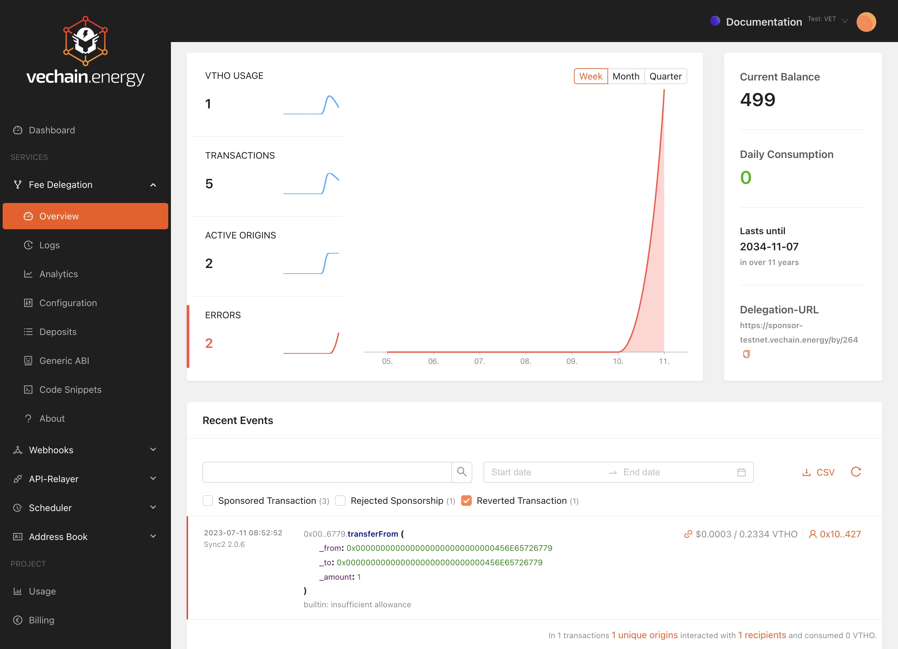

# Debugging

Details about the execution is available in the Dashboard. Information about errors and links to follow up on the involved parties/details is directly available.

## Rejected Sponsorships

A Fee Delegation Sponsorship can be rejected if:

1. The Whitelist has no valid entries
2. The configured Smart Contract does not return true for `canSponsorTransactionFor`
3. The Rate Limit in the Smart Contract is reached after calling `rateLimitSponsorFor`

The details for each rejection are available in the Logs. Using the timeline past events can be loaded and then filtered by type.

### Whitelist

All origins and recipients are matched against the Whitelist. If at least one entries matches, the transaction is sponsored.  
If only the Whitelist is in use, either the recipient address, which normally represents a contract, can be whitelisted – or the origin wallet, if its a known entity.

### Smart Contract

If a Smart Contract is configured, the logic is passed on to the deployed contract. The function `canSponsorTransactionFor` will be called for each clause.

### Rate Limit

If a Smart Contract is configured with Rate Limitting capabilities. The  function `rateLimitSponsorFor` will be called for each clause, the result with the lowest limits will be applied.

## Reverted Transactions

All transactions that are sponsored by the delegation wallets are tracked and archived. The information is publicly available on the blockchain and stored for debugging purpose.

The revert message of the contract is shown after the decoded function name to support manual debugging.

