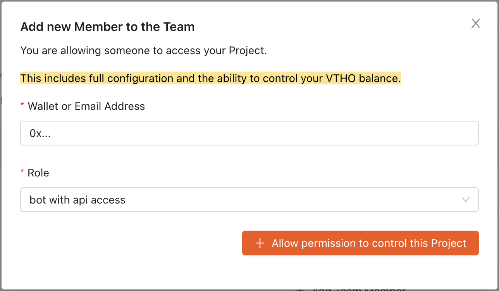

# On-Chain Whitelist Management

Normally, the settings for who can send and receive are managed through a web interface. However, these settings can also be directly managed in the contracts themselves.

For situations that require more complex or automated control, creating a [custom contract](http://localhost:3000/vechain.energy/FeeDelegation/Contract-Verification/) is recommended.

## Setup Access

To gain access to the contract, add a wallet assigned the role `bot` to the team.



## Contract Addresses

| Network | Address                                      |
| :------ | :------------------------------------------- |
| Main    | `0xe0ab6916048ee208154bd76f1343d84b726fa62a` |
| Test    | `0x0bc7cc67d618a9b5054183faa3b58a25bd5bb928` |

## Interface

```solidity
function addAllowedSenderFor(address _address, uint256 tokenId)
function removeAllowedSenderFor(address _address, uint256 tokenId)
function addAllowedRecipientFor(address _address, uint256 tokenId)
function removeAllowedRecipientFor(address _address, uint256 tokenId)
function addMaintainerFor(address _address, uint256 tokenId)
function removeMaintainerFor(address _address, uint256 tokenId)
function setContractFor(address _address, uint256 tokenId)
function contractOf(uint256 tokenId) public view returns (address)
function allowedSendersFor(uint256 tokenId) returns (address[] memory)
function allowedRecipientsFor(uint256 tokenId) returns (address[] memory)
function maintainersFor(uint256 tokenId) returns (address[] memory)
```

## ABI

You can find the Token ID for your project in the `Settings` section.

```json
[
  {
    "inputs": [
      {
        "internalType": "address",
        "name": "_address",
        "type": "address"
      },
      {
        "internalType": "uint256",
        "name": "tokenId",
        "type": "uint256"
      }
    ],
    "name": "addAllowedRecipientFor",
    "outputs": [],
    "stateMutability": "nonpayable",
    "type": "function"
  },
  {
    "inputs": [
      {
        "internalType": "address",
        "name": "_address",
        "type": "address"
      },
      {
        "internalType": "uint256",
        "name": "tokenId",
        "type": "uint256"
      }
    ],
    "name": "addAllowedSenderFor",
    "outputs": [],
    "stateMutability": "nonpayable",
    "type": "function"
  },
  {
    "inputs": [
      {
        "internalType": "address",
        "name": "_address",
        "type": "address"
      },
      {
        "internalType": "uint256",
        "name": "tokenId",
        "type": "uint256"
      }
    ],
    "name": "addMaintainerFor",
    "outputs": [],
    "stateMutability": "nonpayable",
    "type": "function"
  },
  {
    "inputs": [
      {
        "internalType": "uint256",
        "name": "tokenId",
        "type": "uint256"
      }
    ],
    "name": "allowedRecipientsFor",
    "outputs": [
      {
        "internalType": "address[]",
        "name": "",
        "type": "address[]"
      }
    ],
    "stateMutability": "view",
    "type": "function"
  },
  {
    "inputs": [
      {
        "internalType": "uint256",
        "name": "tokenId",
        "type": "uint256"
      }
    ],
    "name": "allowedSendersFor",
    "outputs": [
      {
        "internalType": "address[]",
        "name": "",
        "type": "address[]"
      }
    ],
    "stateMutability": "view",
    "type": "function"
  },
  {
    "inputs": [
      {
        "internalType": "address",
        "name": "_address",
        "type": "address"
      },
      {
        "internalType": "uint256",
        "name": "tokenId",
        "type": "uint256"
      }
    ],
    "name": "removeAllowedRecipientFor",
    "outputs": [],
    "stateMutability": "nonpayable",
    "type": "function"
  },
  {
    "inputs": [
      {
        "internalType": "address",
        "name": "_address",
        "type": "address"
      },
      {
        "internalType": "uint256",
        "name": "tokenId",
        "type": "uint256"
      }
    ],
    "name": "removeAllowedSenderFor",
    "outputs": [],
    "stateMutability": "nonpayable",
    "type": "function"
  },
  {
    "inputs": [
      {
        "internalType": "address",
        "name": "_address",
        "type": "address"
      },
      {
        "internalType": "uint256",
        "name": "tokenId",
        "type": "uint256"
      }
    ],
    "name": "removeMaintainerFor",
    "outputs": [],
    "stateMutability": "nonpayable",
    "type": "function"
  },
  {
    "inputs": [
      {
        "internalType": "uint256",
        "name": "tokenId",
        "type": "uint256"
      }
    ],
    "name": "maintainersFor",
    "outputs": [
      {
        "internalType": "address[]",
        "name": "",
        "type": "address[]"
      }
    ],
    "stateMutability": "view",
    "type": "function"
  },
  {
    "inputs": [
      {
        "internalType": "address",
        "name": "_address",
        "type": "address"
      },
      {
        "internalType": "uint256",
        "name": "tokenId",
        "type": "uint256"
      }
    ],
    "name": "setContractFor",
    "outputs": [],
    "stateMutability": "nonpayable",
    "type": "function"
  },
  {
    "inputs": [
      {
        "internalType": "uint256",
        "name": "tokenId",
        "type": "uint256"
      }
    ],
    "name": "contractOf",
    "outputs": [
      {
        "internalType": "address",
        "name": "",
        "type": "address"
      }
    ],
    "stateMutability": "view",
    "type": "function"
  }
]
```
