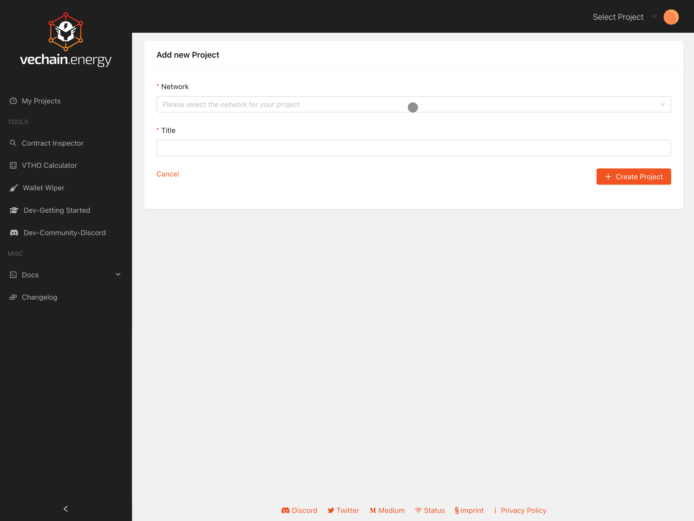
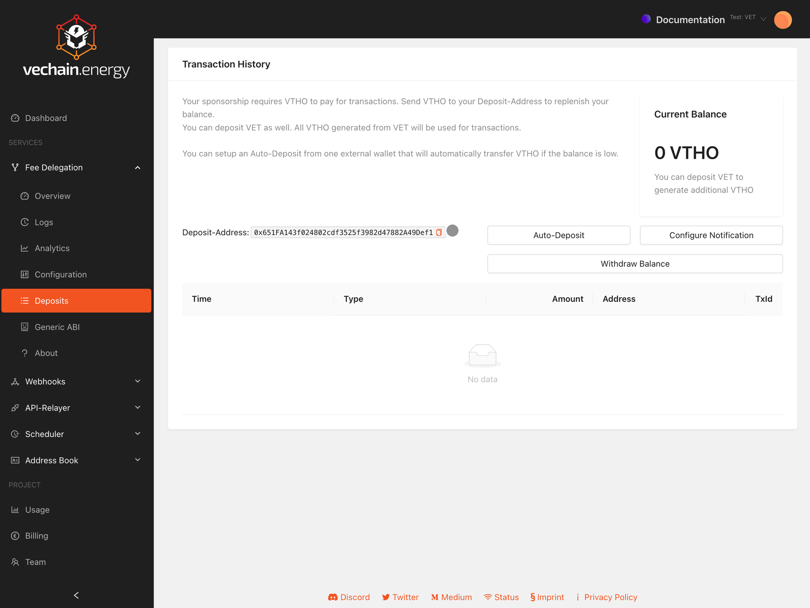
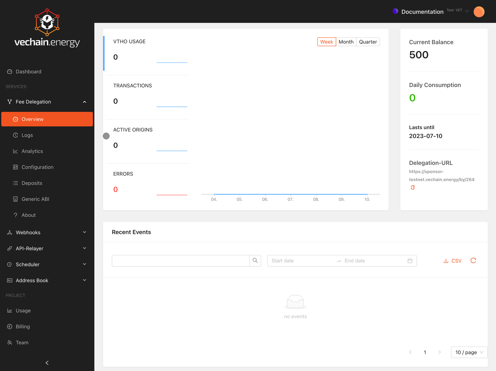
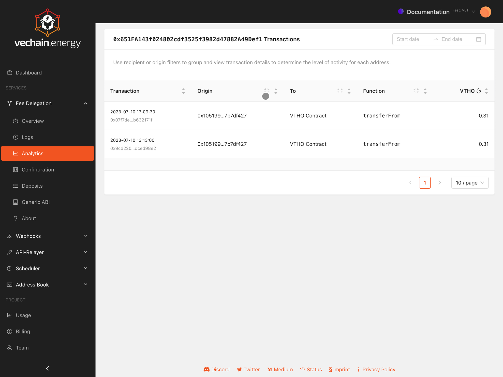

# Setup Fee Delegation Service

Create a project on https://app.vechain.energy:

The creation might take a few seconds, due a NFT been minted on the chain. The NFT is a on-chain-representation of the project and managed in the background.

This process is a good example for Fee Delegation, it does handle the configuration on the blockchain but as user the interaction is hidden to make it feel like a regular web application.

## Deposit Gas Token: VTHO

On the TestNet claim VTHO for free on https://faucet.vecha.in

In `Fee Delegation / Deposits` send VTHO to your Delegation Services wallet:

It is possible to:

- **Auto Deposit** when the balance is below a configured threshold. A suggested configuration to ensure the service will always have enough VTHO in production.
- **Configuration Notifications** to receive an email if the balance is below a configured threshold, to get reminders to deposit more VTHO.

## Configuration of Payment-Rules

To pay for specific transactions the Delegation-Service requires a configuration.

**Whitelist** provides lists of wallets or contracts whose interaction is paid for.
**Smart Contract** allows more blockchain integrated solution where contract information can be used.

For example allowing all users to interact with the Vechain generic "VTHO Contract" requires to add a Whitelist-Entry with its address as recipient:

1. Add Address
2. `0x0000000000000000000000000000456e65726779` as address
3. `recipient` as type

The statistics in the table are based on the network wide usage of that address.

To better identify addresses, a human readable name can be entered by clicking on the address. By adding a name, an Address Book Entry is created which can be configured with tags.

Tags are shown the configuration and can be clicked to filter connected addresses.

## Configure Fee Delegation

The Delegation-URL can be found in the Fee Delegation Overview:

To test the delegation a sample project is available on CodeSandbox.io:

https://f57jz7.csb.app/

Example Snippets for Fee Delegation are available at "Code Snippets". They are fully working transaction examples.

## Configure Transaction-Decoding

All delegation requests are logged by default. The setting can be changed in "Project / Setting".

The transaction data contains all details of the interaction  that can be decoded into a human readable format.

An ABI containing the decoding information is required. It can either be uploaded at `Generic ABI` or in the `Address Book`. Both ABI will be used to decode transactions details and display a human friendly version of the transactions.

## Get more Insight

**Analytics** provide a Spreadsheet-Experience for transaction analytics. Details about the involved addresses, transaction costs and what functions are called can be valuable insights.

**Logs** are a filterable debugging instrument that provides an insight into all kinds of transactions.

Besides successful transactions, rejected Delegation-Requests can point to bad configurations or penetration tests.

Leveraging ABI information and insights into failed transactions can support detecting potential application issues. A CSV enables further processing with external applications.