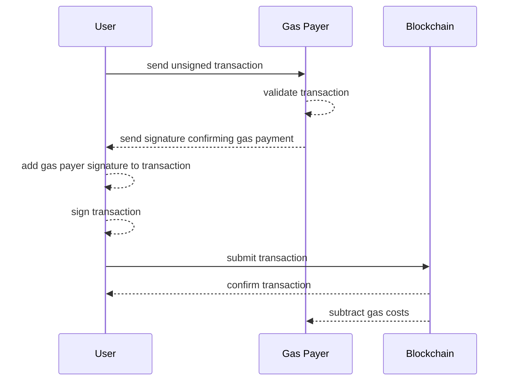

# What is Fee Delegation?

Fee Delegation is a simple process that creates a magical user experience using blockchains without losing decentralized benefits.

The user submitting a transaction requests a second signature from a gas payer.

When the transaction is processed, the gas costs are taken from the gas payers balance instead of the user submitting the transaction.

It creates a feeless and trustless solution for instant blockchain access.

You can read more about it here:
https://docs.vechain.org/thor/learn/fee-delegation

## Why is it important?

It stops users from instantly using an application.
Users that need to pay for transactions are required to obtain a token from somewhere.
Regular users do not know where to go and researching a place to buy and accessing a (de)centralized exchange is too much to ask for a user that wants to use your application.

## What does it allow?

Users can open an application and interact with it instantly. An Application can submit transactions in the background and can no longer be be distinguished from regular(web2) alternatives.
Fee delegation solves the biggest hurdle of user on - boarding to blockchain - applications without invalidating the web3 - principles.

## Want to learn more?

You can learn more about the feature from docs.vechain.org on [How to Integrate VIP-191](https://docs.vechain.org/tutorials/how-to-integrate-VIP-191-1.html).

## What are the use-cases?

Fee Delegation is mostly meant to be implemented to support end-user-experience, removing the need to purchase/collect gas tokens and remove need to pay for the applications activities.

Other use-cases are instant interactions with blockchains from different backends or processes without introducing account management for gas tokens.

## How does it work?

