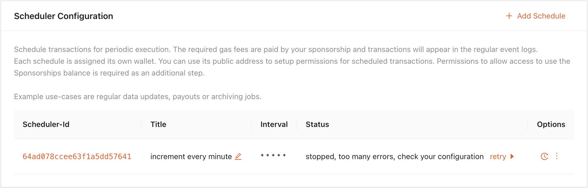

# Debugging

Details about the execution is available in the Dashboard by clicking on the called function name and in the Scheduler Logs by expanding each entry

## Fee Delegation is Low on VTHO

If the delegation wallet does not have enough VTHO, the transaction cannot be broadcast to the blockchain. No retry will be done for a failed execution.

## Contract Reverts

Schedulers are responsible for broadcasting a transaction; they will not track its result to handle the outcome of a transaction.

Reverted transactions can be tracked on the Dashboard using the Fee Delegation Logs.

## Paused due too many errors

After several consecutive failures to broadcast a transaction, the Scheduler will pause automatically.

It is possible to reset the errors and retry without changes.

