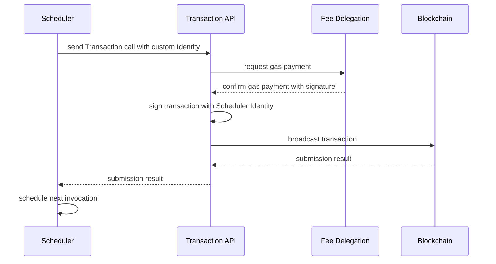

# What are Schedulers?

Blockchains lack the ability to schedule repetitive tasks. Many projects, however, require that certain actions are executed periodically.

An example can be a regular payout or snapshots for archiving data.

To prevent teams from writing complex scripts themselves that create transactions, manage gas fees, sign them, and broadcast all to the blockchain, schedulers provide a web-configurable alternative.

## Why is it important?

Calling a function at regular intervals extends the core functionality of every program. With the periodically execution the building blocks are extended and more complex solutions can be built.

## What does it allow?

Schedulers enable projects to streamline processes by automating tasks that need to be executed on a recurring basis. For example, a scheduler can be set up to automatically increment a counter in a smart contract every hour or perform certain calculations and updates at the end of each day. This automation saves time and resources that would otherwise be spent on manual execution of these actions.

Schedulers enhance the reliability and consistency of contract executions. By defining the schedule and relying on the Fee Delegation Service to handle gas fees and transaction broadcasting, schedulers ensure that the required actions are performed consistently and accurately. This helps maintain the integrity of the project's operations and provides a predictable framework for executing essential tasks.

## What are the use-cases?

One real-world use-case for schedulers is the implementation of a notification and auto-deposit system. This system relies on schedulers to regularly simulate transactions and check for low balances in Fee Delegation Wallets.

The contracts built for this use-case are designed to revert until a low-balance situation occurs. When the balance reaches a certain threshold, an event is triggered, allowing the system to send notifications or automatically initiate deposits to ensure the continuous operation of the service.

By utilizing schedulers in this manner, projects can proactively monitor the balances of Fee Delegation Wallets and take appropriate actions when necessary. This use-case is particularly useful in scenarios where maintaining sufficient funds for transaction execution is crucial. The combination of schedulers, smart contracts, and automated notifications or deposits helps ensure the smooth functioning of services and prevents disruptions due to insufficient balances.

While the notification and auto-deposit system is a specific use-case, schedulers have a wide range of applications. They can be utilized for tasks such as regular data backups, recurring payments, scheduled updates, and maintenance activities. The versatility of schedulers enables projects to automate repetitive tasks, improve efficiency, and enhance the reliability of their blockchain-based applications.

Overall, schedulers provide a powerful tool for automating actions based on predefined conditions, making them invaluable for various use-cases in blockchain projects.

## How does it work?

A scheduler executes contract functions periodically. The required gas fees are paid by the Fee Delegation Service, and transactions will appear in the regular event logs. Each schedule is assigned its own wallet. Its public address can be used to set up appropriate permissions on the contracts.

