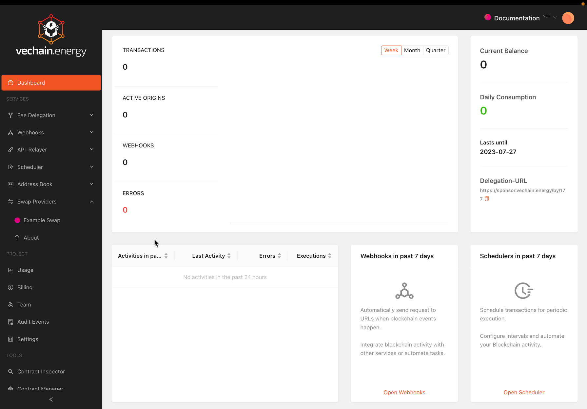

# Setup Swap Provider

## Create Swap Provider

A Swap Provider has no specific requirements. It needs to be activated to be accessible by users.

### Supported Networks

Swap Providers are available for Projects at **Vechain MainNet** only.

### Theme

A theme can be configured to better match it into the website. Dark & Light provide a basic algorithm to better calculate the derived colors from the input.
The available color configuration adjusts the basic colors of the theme.
Different progress steps can be previewed to ensure the colors match in every situation.

### Implementation

The Swap Provider is designed to not grow outside of 840px height and fill 100% of the width given.
An implementation HTML snippet is available in the details. One snippet is available for Token Swaps and one for Fiat Purchases, to provide full control of implemention for the dApps.

