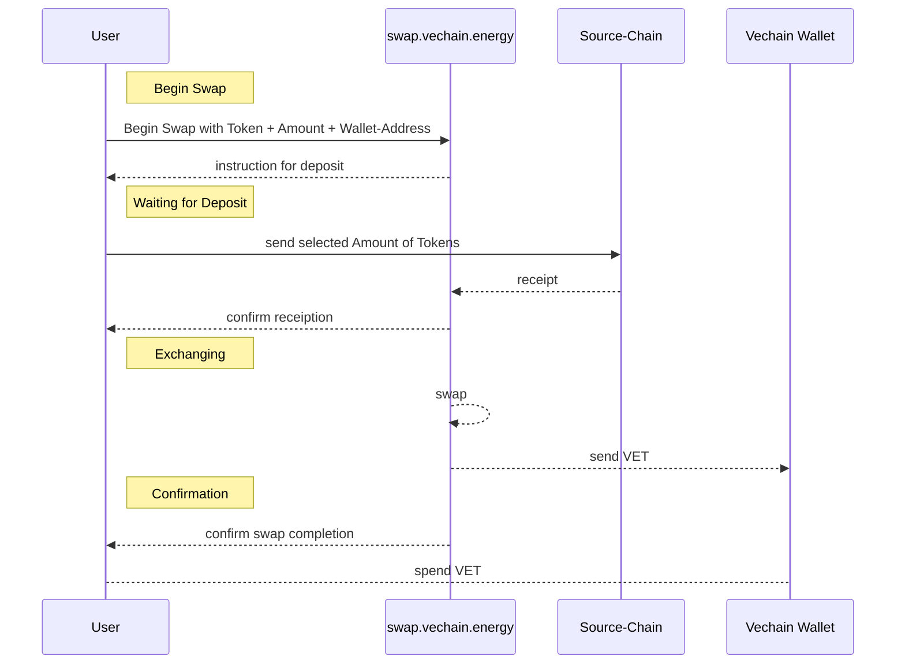

# What are Swap Providers?

A Swap Provider provides access to a Token-Swap within a dApp.

## Why is it important?

Sending users away to other platforms to swap tokens is a bad user experience and creates potential user loss.

Embedding a form on the website allows users to swap tokens from different networks without leaving your platform. Users can stay the website and enjoy a better experience.

## How does it work?

Every Swap Provider has a unique link that can be embedded as an IFrame. The IFrame displays a form for the swap and a status of the swap-process.
In the background third parties are managing the swap-process that define the minimum/maximum available amount for the swap and the exchange rate.
In rare cases the swap-process can fail or require a KYC. In this case the user will be notified and support is provided directly.

