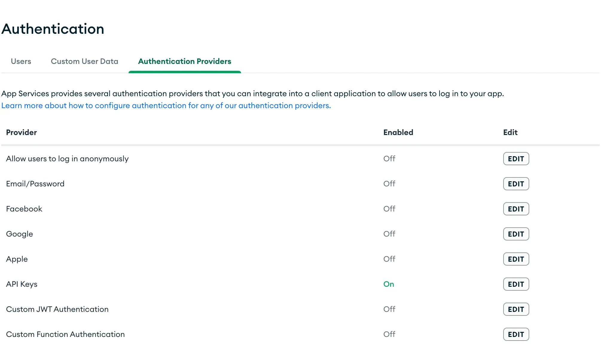
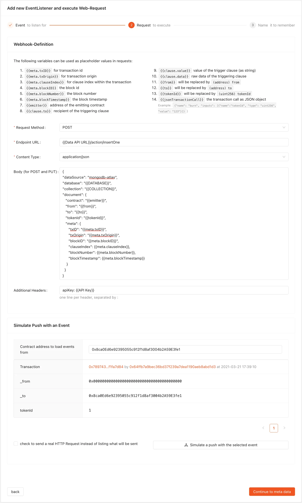

# How to Connect MongoDB with Webhooks & Blockchain-Events

With the ability to trigger HTTP Requests when a Blockchain-Event occurs, the possibility of synchronizing it with a data storage is created as well.

This is a step-by-step guide to setting up an data transport from MongoDB using Webhooks and MongoDB Atlas.

# Setup Database

After signing up on mongodb.com, create a database, and go to the "App Services" section.

## Permissions

To set up permissions, create a new App Service and give it permission to write to a specific collection using preset rules.


Use API Keys as the authentication provider:



create an API Key, and copy the URL from the "HTTPS Endpoints" menu:


You will need the following information next:

1. API Key
2. URL of your Data API
3. Name of your database created within your MongoDB instance
4. Name of your collection

# Setup Webhook

After signing in to vechain.energy and creating a project, select "New Webhook" from the menu.

Enter your Event definition and the contract address that emits the event:


## Connection to MongoDB

Configure the Webhooks HTTP Request:

* Request Method: `POST`
* Endpoint URL: Data API URL + `/action/insertOne`
* Content-Type: `application/json`
* Additional Headers: `apiKey: <Your API Key>`
* Body with the database and collection and the document format:

```json
{
"dataSource": "mongodb-atlas",
"database": "{{DATABASE))",
"collection": "{{COLLECTION}}",
"document": {
   "contract": "{{emitter}}",
   "from": "{{from}}",
   "to": "{{to}}",
   "tokenId": "{{tokenId}}",
   "meta": {
      "txID": "{{meta.txID}}",
      "txOrigin": "{{meta.txOrigin}}",
      "blockID": "{{meta.blockID}}",
      "clauseIndex": {{meta.clauseIndex}},
      "blockNumber": {{meta.blockNumber}},
      "blockTimestamp": {{meta.blockTimestamp}}
    }
  }
}
```



## Test

Use the simulation to test the Webhook and adjust the configuration if needed:


Send a real request during simulation to test if the data is correctly send.

On MongoDB verify that the simulated document is correctly stored by accessing the receiving collection:


 
## Save
 
Finally, save and activate the Webhook:
 


## Retroactive Data Transfer

If you need to access past data, the webhooks feature "Backfill" can help. Simply select the contract address and the desired block range, and the data transfers will be triggered retroactively:
	

 
 # Conclusion
 
 In conclusion, connecting MongoDB with Webhooks and Blockchain-Events allows for real-time synchronization of blockchain event data with data storage.
 
 The setup process involves creating a database in MongoDB Atlas, granting permissions for the new App Service, setting up an HTTP Request for Webhooks, and testing the connection.
 
 With this setup, blockchain events can be automatically saved to MongoDB and accessed for further analysis and use.
 
 For those who need older data, the "Backfill" feature of webhooks allows them to retroactively transfer data over a specified block range.