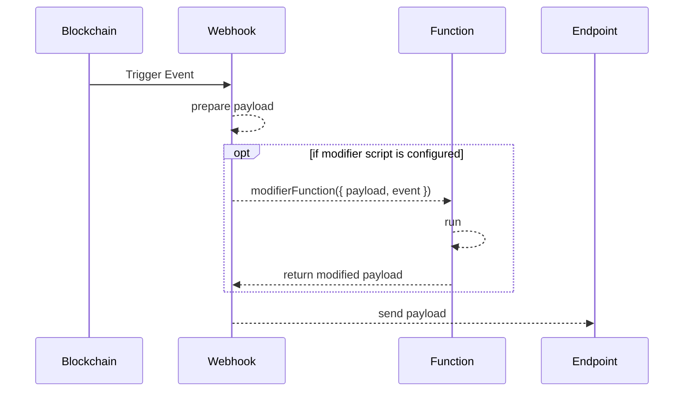

# Webhook Function

A webhook function is a pure JavaScript function that runs in an isolated environment as the final processing step before passing it to the receiving endpoint.

In the environment access to blockchain data is provided and the ability to fetch data from the internet.

The returned value is passed to the configured Endpoint.


## How it works



## Function Definition

The modifier function is called with an object that has the original Payload and the raw Event as attributes:

```javascript
({ payload, event }) => {
    return { payload, event }
}
```

The returned values will be passed on to the configured Endpoint.

| Attribute | Description                                           |
| --------- | ----------------------------------------------------- |
| `payload` | Manually configured Payload with placeholders filled. |
| `event`   | Raw event information                                 |

### Async Function

An example of an async-await function is:

```javascript
async ({ payload, event }) => {
    return { payload, event }
}
```

## Limits

* Maximum Execution Time is 10 seconds
* Total Memory Limit is 128 MB
