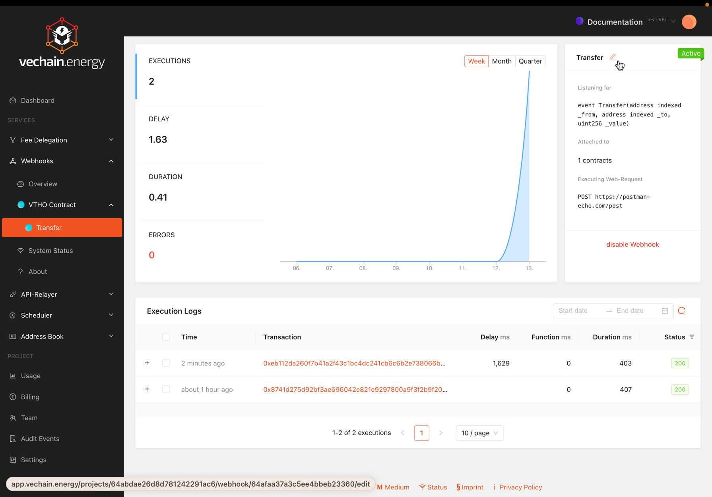

## Create Webhook

Different types of Webhooks are available with different data.

###  Create Contract-Event Webhook

Events are signals that are emitted from smart contracts. Every event is logged, immutable and accessable using a blockchain node only. Smart contracts can not access events themselves.
Client-Applications can actively listen to events and act accordingly.

To listen for an Event, a contract address and the Event-ABI is required.

If the contract is in the Address Book, the Event can be selected:

To ensure the accuracy of data and test its quality, a transaction ID is required. The transaction id will be used to make sure that data will be found and the input works.

## Define HTTP-Request

The HTTP request can be defined with the request method, endpoint URL, content type, headers, and the body to be sent.

To ensure the configuration is correct, a test request can be sent. The test will use the previously entered transaction details and send it to the the configured endpoint.

## Activate Webhook

You can enable or disable webhooks in its dashboard or settings.

## Logs

In the dashboard, you can find combined web hook requests and access to the request details.

The Execution Logs in the Webhooks section provide a filterable list and additional details about each execution.

The status is filterable to identify problems during processing or with the receiving backend.

