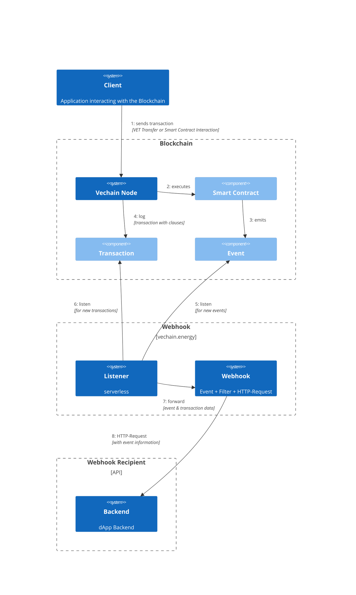

# What are Webhooks?

Information stored on the blockchain cannot interact with the internet or trigger actions on other services. With the help of webhooks, you can establish a connection between the blockchain and other services on the internet.

Webhooks enable to automatically send a request to a particular URL when a specific event happens on the blockchain.

With the help of webhooks, tasks can be automated or blockchain activity integrated with other services.

## Why is it important?

Setting up a blockchain-webhook integration is crucial because it:

- **Automates processes** by seamlessly connecting the blockchain with other internet services, reducing manual intervention and improving efficiency.
- **Enables integration** with external services, such as web applications and APIs, allowing businesses to leverage decentralized technology within their existing infrastructure.
- Provides **real-time event notifications**, allowing businesses to promptly respond to critical events and ensure smooth processes.
- Facilitates **data synchronization and indexing** by triggering webhooks for past events, keeping systems up to date and enabling efficient search and retrieval operations.

In summary, a blockchain-webhook integration is important for automation, integration, real-time notifications, and effective data management.

## What are the use-cases?

Webhooks have several possible use cases, including:
- **Oracles:** Webhooks can be used to provide trustworthy information from off-chain sources, such as data feeds or APIs, to the blockchain.
- **Indexers:** Webhooks can also be used to collect activity from the blockchain and update it for other services or applications.
- **Integration with other web services:** Webhooks can enable integration with other web services, such as IFTTT or Zapier, allowing for automated workflows and tasks based on blockchain activity.

## How does it work?

A scheduler executes contract functions periodically. The required gas fees are paid by the Fee Delegation Service, and transactions will appear in the regular event logs. Each schedule is assigned its own wallet. Its public address can be used to set up appropriate permissions on the contracts.

