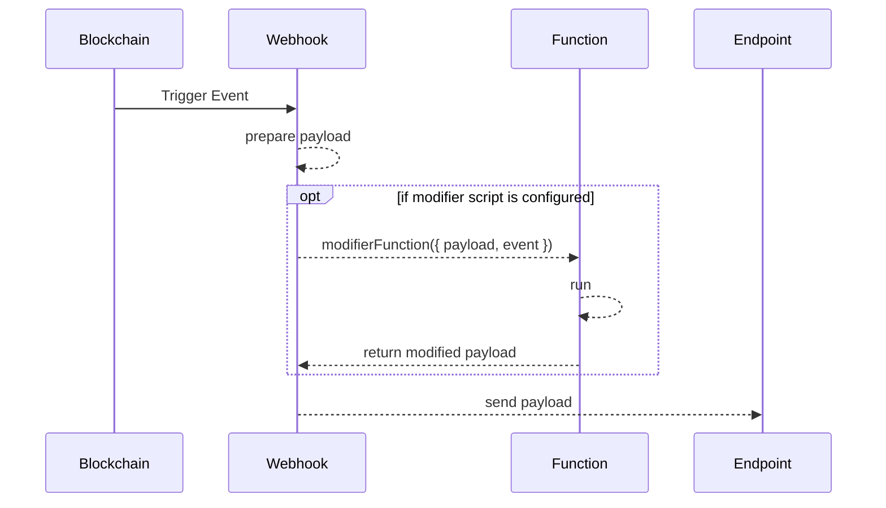

# Functions

Running custom functions to modify the Payload that will be sent to the Endpoint. The configured Payload is run through the modifier function, and the result will be passed to the Endpoint.

The functionality available within the modifier script is limited to pure javascript functions and connectivity functions that allow to fetch additional blockchain data (cross-vechain).



## Function Definition

The modifier function is called with an object that has the original Payload and the raw Event as attributes:

```javascript
({ payload, event }) => {
    return { payload, event }
}
```

The returned values will be passed on to the configured Endpoint.

| Attribute | Description                                           |
| --------- | ----------------------------------------------------- |
| `payload` | Manually configured Payload with placeholders filled. |
| `event`   | Raw event information                                 |

### Async Function

An example of an async-await function is:

```javascript
async ({ payload, event }) => {
    return { payload, event }
}
```

## Limits

* Maximum Execution Time is 10 seconds
* Total Memory Limit is 128 MB


