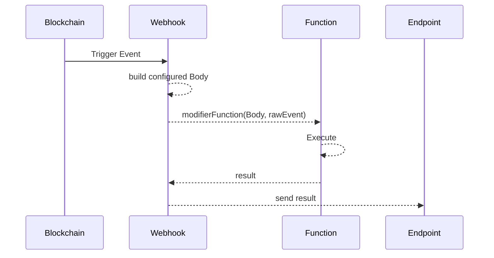

# Scripts

Running custom javascript snippets support a custom modification of the body that will be sent to the Endpoint. The configured Body is run thru the modifier function and the result will be passsed to the Endpoint.

The functionality available within the modifier script is limited to pure javascript functions and connectivity functions that allow to fetch additional data.



## Function Definition

The modifier function is called with two arguments, the original Body and the raw Event:

```javascript
(body, event) => {
    return { body, event }
}
```

The expected output and data posted to the endpoint will be a JSON containing `{ body, event }`.

### Async Function

Example for an async-await function is:

```javascript
async (body, event) => {
    return { body, event }
}
```

## Connectivity

Some generic functions that provide connectivity to other services for data enhancement are available. For example reading contract data or event information.

### Call-API

Does a POST request to the [Call-API](../../../read-data-from-smart-contracts/) in the background. The result will be returned.

```typescript
type Network = 'main' | 'test'
type CallOptions = {
    network?: Network
    decodeBytes?: boolean
    encodeBytes?: boolean
    formatEther?: boolean
    revision?: string | number
}

Energy.call: (
    clauses: RequestClause | RequestClause[],
    options?: CallOptions
) => Promise<any>
```

#### Example

Using the balanceOf ABI from the VTHO contract the balance of the transaction origin is returned and will be passsed to the Webhook endpoint:

```typescript
async (body, event) => {
  const originVthoBalance = await Energy.call({
      to: "0x0000000000000000000000000000456E65726779",
      abi: {"type":"function","name":"balanceOf","constant":true,"stateMutability":"view","payable":false,"inputs":[{"type":"address","name":"owner"}],"outputs":[{"type":"uint256"}]},
      args: [event.meta.txOrigin]
    }, { formatEther: true })

  return { origin: event.meta.txOrigin, vtho: originVthoBalance }
}
```

### Events-API

Does a POST request to the [Event-API](../../../../coding/by-language/python/read-events-on-every-new-block.md) in the background. The result will be returned.

```typescript
type Network = 'main' | 'test'
type EventOptions = {
    network?: Network
    unit?: 'block' | 'time'
    from?: number
    to?: number
    offset?: number
    limit?: number
    order?: 'asc' | 'desc'
}

Energy.call: (
    events: RequestEvent | RequestEvent[],
    options?: EventOptions
) => Promise<any>
```

#### Example

Using the Signature definition of a token transfer, the very first VTHO transfer is read and the  balance of the participants before the transfer returned.

```typescript
async (body, event) => {
  const [firstTransfer] = await Energy.events({
      address: "0x0000000000000000000000000000456E65726779",
      signature: "Transfer (address indexed _from, address indexed _to, uint256 _value)"
  }, { order: "asc", limit: 1 })

  const [senderBalance, recipientBalance] = await Energy.call([
    {
      to: "0x0000000000000000000000000000456E65726779",
      abi: {"type":"function","name":"balanceOf","constant":true,"stateMutability":"view","payable":false,"inputs":[{"type":"address","name":"owner"}],"outputs":[{"type":"uint256",name:"vtho"}]},
      args: [firstTransfer._from]
    },
    {
      to: "0x0000000000000000000000000000456E65726779",
      abi: {"type":"function","name":"balanceOf","constant":true,"stateMutability":"view","payable":false,"inputs":[{"type":"address","name":"owner"}],"outputs":[{"type":"uint256",name:"vtho"}]},
      args: [firstTransfer._to]
    }
    ], { formatEther: true, revision: firstTransfer._meta.blockNumber - 1 })

  return { firstTransfer, senderBalance, recipientBalance }
}
```


