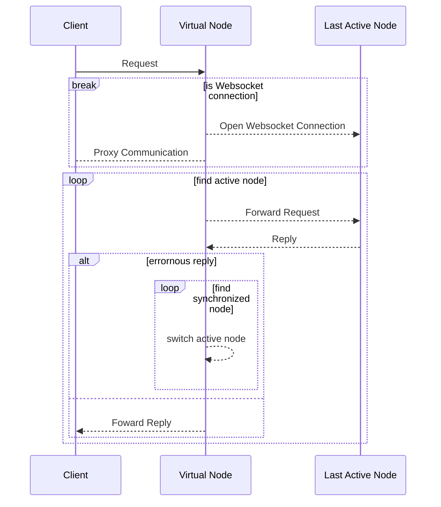

# Virtual Proxy Node

## Addresses

| Network | URL                                 |
| ------- | ----------------------------------- |
| MainNet | https://node-mainnet.vechain.energy |
| TestNet | https://node-testnet.vechain.energy |

## Features

* Websockets are supported without error checking
* Nodes are tested to be synchronized in the past 5 minutes
* CORS headers by default
* Returns the used node url in the headers in `x-node-url`

